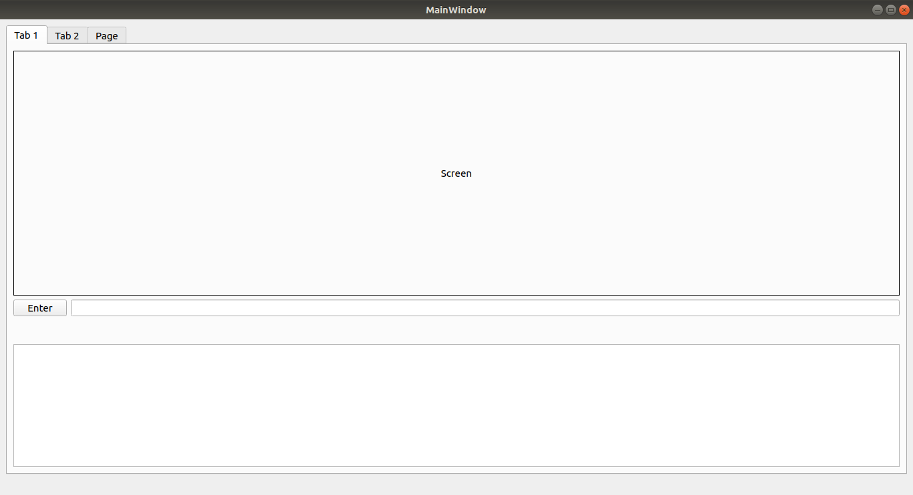
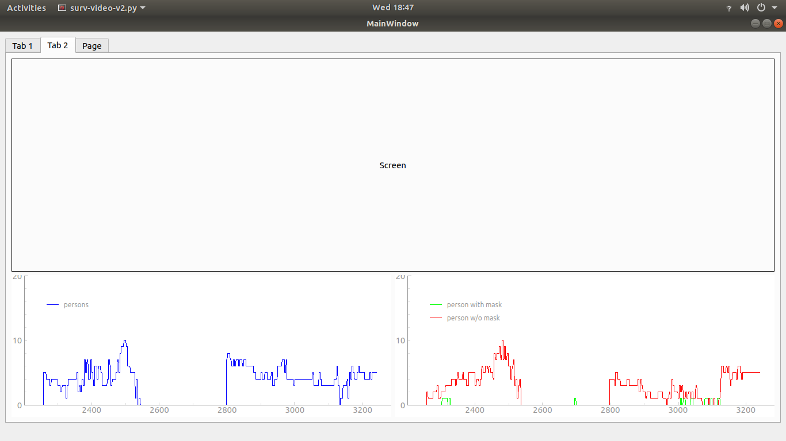
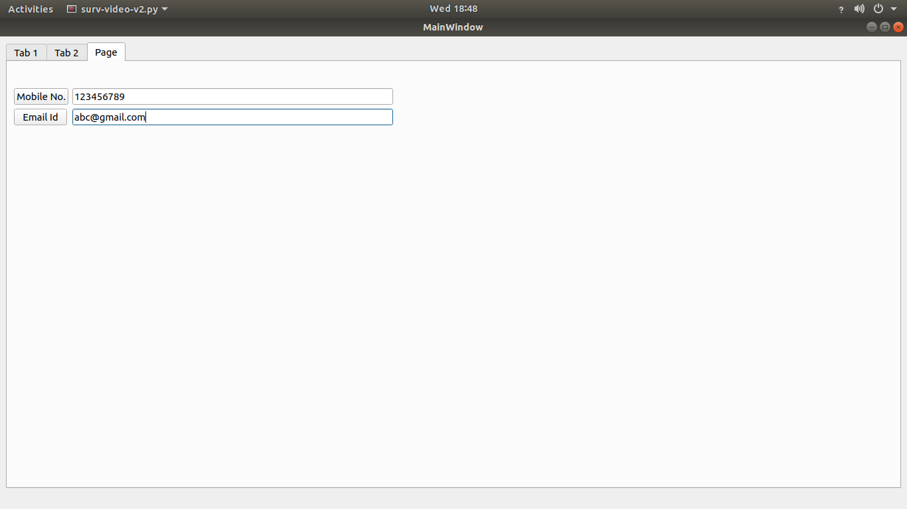

## Note: I've used python3 virenv for this project

## install nanodet in your system
https://github.com/RangiLyu/nanodet

## install requirements 
pip -r install requirements

## to run the app
python3 surv-video-v2.py

## after starting the app enter full video path and press enter

## Some screenshot of app

